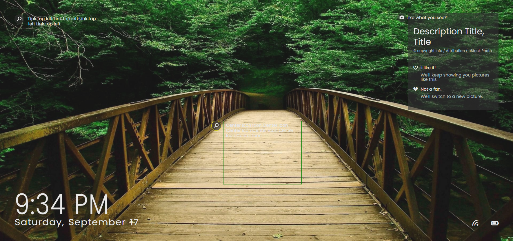

"# ms-windows-login" 
## Over View

Recreating the windows lockscreen / login look at functionality. 

## Tech Used
- SASS
- Javascript / ES6
- Fontawesome 5.15.3 - Local copy available and cdn can be used.
## Things Learned / Practicing:

#Learning:
- BEM class naming Conventions
- Fetching API's

#Practicing: 
- SASS
- JavaScript
- Fetching API's

### Screenshot

[Link to live project](https://rudyjm3.github.io/ms-windows-login/)

#Helpful Links Below:
(To open url links in a new tab "CTRL" + Left Click)

- [CSS Naming Conventions That Will Save You Hours of Debugging](https://www.freecodecamp.org/news/css-naming-conventions-that-will-save-you-hours-of-debugging-35cea737d849/)
- [BEM 101](https://css-tricks.com/bem-101/)
- [BEM and SASS, a Perfect Match](https://andrew-barnes.medium.com/bem-and-sass-a-perfect-match-5e48d9bc3894])
- [Getting the date and formating it](https://www.w3schools.com/jsref/jsref_getday.asp)

#Links for Bing image of the day API
- (https://stackoverflow.com/questions/10639914/is-there-a-way-to-get-bings-photo-of-the-day)
- (https://www.codeproject.com/Tips/1044421/Use-Bing-Photo-of-the-Day-in-Your-Application)
- [Github repository](https://github.com/TimothyYe/bing-wallpaper)
## Updates
- Switched project over to SASS 9/12/2022
- Updated class names in HTML doc for BEM style naming 9/12/2022